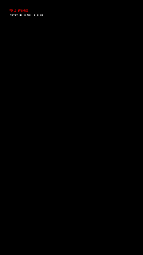
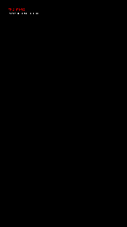
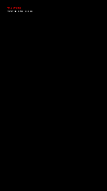
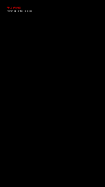
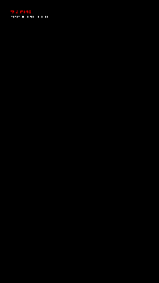
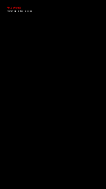
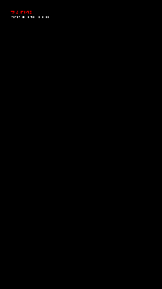
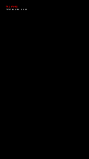
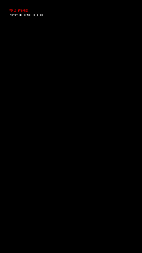
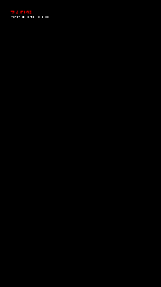

# miniOS Operator UI

Auto-generated catalogue of every TSV-defined operator page in `devices/embedded_ui.tsv`.
Refresh by running the **UI screenshots** GitHub Actions workflow (or
`bash scripts/qemu_dump_ui_pages.sh screenshots && python3 scripts/generate_ui_md.py screenshots UI.md`
locally).

Each shot below is the guest framebuffer rendered by the `arm64` kernel,
captured via the CLI `ui_page <id>` + `ui_dump <scale>` commands and
downscaled by the factor noted at capture time.

## Pages

- [Dashboard](#dashboard) — `dashboard`
- [Jog](#jog) — `jog`
- [MDI](#mdi) — `mdi`
- [Machine View](#machine-view) — `machine_view`
- [Program](#program) — `program`
- [Offsets](#offsets) — `offsets`
- [Service](#service) — `service`
- [EtherCAT](#ethercat) — `ethercat`
- [Homing](#homing) — `homing`
- [Alarms](#alarms) — `alarms`
- [Macros](#macros) — `macros`
- [Probe](#probe) — `probe`
- [Pitch Error](#pec) — `pec`
- [Geometry Comp](#geometry) — `geometry`
- [Volumetric Comp](#sphere) — `sphere`
- [Network](#network) — `network`
- [Axis Detail](#axis-status) — `axis_status`
- [Tool Change](#tool-change) — `tool_change`
- [Restart Confirm](#restart-confirm) — `restart_confirm`

### Dashboard

`ui_page dashboard` — defined in `devices/embedded_ui.tsv`.

### Jog

`ui_page jog` — defined in `devices/embedded_ui.tsv`.

### MDI

`ui_page mdi` — defined in `devices/embedded_ui.tsv`.

### Machine View

`ui_page machine_view` — defined in `devices/embedded_ui.tsv`.

### Program

`ui_page program` — defined in `devices/embedded_ui.tsv`.

### Offsets

`ui_page offsets` — defined in `devices/embedded_ui.tsv`.

### Service

`ui_page service` — defined in `devices/embedded_ui.tsv`.

### EtherCAT

`ui_page ethercat` — defined in `devices/embedded_ui.tsv`.

### Homing

`ui_page homing` — defined in `devices/embedded_ui.tsv`.

### Alarms

`ui_page alarms` — defined in `devices/embedded_ui.tsv`.

### Macros

`ui_page macros` — defined in `devices/embedded_ui.tsv`.

### Probe

`ui_page probe` — defined in `devices/embedded_ui.tsv`.

### Pitch Error

`ui_page pec` — defined in `devices/embedded_ui.tsv`.

### Geometry Comp

`ui_page geometry` — defined in `devices/embedded_ui.tsv`.

### Volumetric Comp

`ui_page sphere` — defined in `devices/embedded_ui.tsv`.

### Network

`ui_page network` — defined in `devices/embedded_ui.tsv`.

### Axis Detail

`ui_page axis_status` — defined in `devices/embedded_ui.tsv`.

### Tool Change

`ui_page tool_change` — defined in `devices/embedded_ui.tsv`.

### Restart Confirm

`ui_page restart_confirm` — defined in `devices/embedded_ui.tsv`.

---

*Generated 2026-05-09 18:48:01 UTC from `devices/embedded_ui.tsv` (19 pages).*
