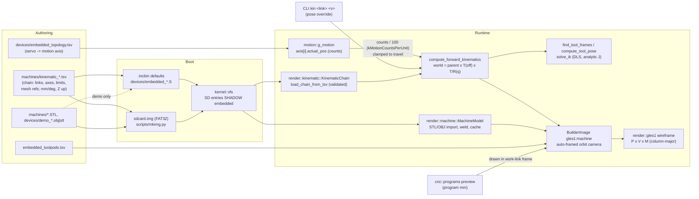

# Machine model: kinematics, meshes and the live machine view

How a machine is described, loaded, posed and drawn inside miniOS, and what
is and isn't fit for simulation yet. Companion to `machines/README.md`, which
covers authoring chains in the browser editor.

## Data flow

1. **Authoring.** A chain TSV row is one link:
   `name,type,parent,dir,off,min,max,mesh,channel,motion_axis[,obj_file[,mesh_off,mesh_rot[,mesh_scale]]]`
   (14/15/21/22 columns; the header line fixes the count). A link's joint
   frame is `parent.world × T(off) × (T(dir·q) | R(dir, q))`, and its mesh
   sits at `T(mesh_off)·R(mesh_rot)·S(mesh_scale)` inside that frame. A
   rotary therefore turns about its own origin: put `off` on the axis and
   move the STL back with `mesh_off` (see the MX850 B/C rows).
2. **Boot.** The three chain TSVs, the toolpods TSV and the demo meshes are
   `.incbin`'d. `sdcard.img` carries the MX850 STLs plus copies of the TSVs,
   and **anything on the card replaces the embedded copy of the same path**.
   A stale card silently overrides a new kernel, so CI now checks that
   `sdcard.img` equals `python3 scripts/mkimg.py` output.
3. **Load.** The machine view picks the MX850 chain when its meshes are
   present, otherwise mill3/millturn by which motion axes are live. STL/OBJ
   parts are welded into exact-size blocks from a once-allocated scratch
   arena and cached by name (the heap is a never-freeing bump allocator).
4. **Pose.** Each UI tick, `sync_live_axes` maps `actual_pos` counts to
   mm/deg, clamps to travel, applies any `kin` overrides and runs FK.
5. **Draw.** The camera orbits the machine's bounding sphere (computed once
   per load). Toolpath and probe overlays are drawn in the work link's frame,
   so they sit on and move with the table. The widget repaints when
   positions, overrides, view toggles or the program preview change, plus a
   1 s heartbeat.

## Conventions

| Quantity | Unit / convention |
|---|---|
| Chain, meshes, overlays, toolpods | millimetres, Z up, right-handed |
| Rotary positions | degrees, right-hand rule about the normalised `dir` |
| Motion → chain | `actual_pos / kinematic::kMotionCountsPerUnit` (100 counts per mm or deg, the interpreter's scale) |
| Matrices | column-major, `m[col*4+row]`, column vectors: `P·V·M`, `T·R·S` |
| Tool pose | tool link origin + its +Z, expressed in the work link frame |

## Tools

- `test kin` (included in `test all`) checks the matrix conventions and that
  the parser rejects malformed chains (7 cases, plus an over-long line and
  exponent parsing). Then, for every shipped chain: linear steps move a link
  by exactly the step, rotary steps keep descendants' distance to the joint,
  +360° restores every transform, and 24 random FK→IK→FK round trips must
  converge (<2 µm, <2e-5 axis error).
- `kin` dumps the live chain (positions, link origins, tool pose, render
  count/time, UI loop count). `kin <link> <mm|deg>` poses a link without
  drives, `kin clear` returns to motion, and `kin zoom <f>` scales the camera.
- `python3 scripts/mkimg.py` rebuilds `sdcard.img` reproducibly (pure Python;
  `scripts/mkimg.sh` wraps it).

## Findings

Ordered by value for simulation. **Fixed** items landed with this note.

### Fixed

1. **Machine view was always blank.** `gles1::multiply` returned (A·B)ᵀ and
   `make_look_at` put the camera basis in columns, so every MVP was
   transposed and the target sat behind the eye. `make_rotation_z` was also
   transposed (−θ).
2. **`rsqrt_approx` diverged away from 1** (1/v seed): a 10 mm vector
   normalised to length 0.22. Now a bit-trick seed plus 3 Newton steps.
3. **No single unit system.** mill3/millturn offsets were in metres on a
   Y-up axis, travels were mm, MX850 was mm, primitives were ~100 mm "units",
   toolpods/probe were ×0.01 and the toolpath was raw mm. Everything is now
   mm/Z-up, with one counts→mm constant, and the camera auto-frames.
4. **MX850 B/C rotated about the STL origin** (1–2 m off-axis). Pivots were
   fitted from the STL cylinders: C at the table centre (1364.0, 1114.05,
   984.8) and B along X at y=1114.05, z≈986 (±3 mm). *Confirm against the
   drawings.*
5. **Concurrent renders corrupted meshes.** The CLI (`ui_page`, `ui_dump`,
   `test ui`) and the UI thread rendered the tree at the same time; the
   machine-view import ran twice over the shared scratch arena. Every
   whole-tree render now holds the UI state lock, whose waiters yield.
6. **Bound widgets never repainted on their own.** `Container::render` only
   descended into dirty children, so a leaf's `mark_dirty()` was lost until
   a page switch. The DRO and machine view were effectively frozen outside
   CLI-forced renders. Clean containers now pass repaints down to their
   dirty descendants, and the root does a partial (no-clear) update.
7. **Machine view re-rendered on every UI tick** even when idle. It is now
   gated on a scene signature plus a 1 s heartbeat. It costs 20–50 ms per
   frame on TCG; the old "~1 s" figure came from the deleted per-frame depth
   buffer.
8. **Parser robustness.** Parents must precede children (no cycles; FK is
   one forward pass), names must be unique, types known, directions non-zero
   (and normalised), `min ≤ max`, channel and motion_axis in range, and a
   >255-char line is rejected instead of being split into two rows. Floats
   accept `+` and exponents. Seven duplicated float parsers became one
   (`kernel::util::parse_float[_at]`).
9. **Meshes.** STL vertices are welded (hash on position+normal), zero
   normals are recomputed, non-finite facets are skipped, capacity is checked, parts go into
   exact-size blocks and are cached across reloads. The unused 5.2 MB depth
   buffer per widget is gone. The heap holds 3.5 MB of 8 MB with the full
   MX850 set.
10. **CRLF checkouts** broke the embedded UI TSV (`"\r"` record type). The
    loader now tolerates CR, `.gitattributes` pins the embedded inputs to LF,
    and `mkimg.py` normalises the text files it writes to the card.
11. **Without an SD card,** the embedded MX850 chain rendered seven scattered
    placeholder cubes. MX850 is now chosen only when its meshes resolve.
12. **Dead code removed:** `render/benchmark.*`, `obj::entries/entry_count`,
    and six unused kinematic API functions. The editor round-trip test now
    runs in CI.

### Deferred (recommended order)

1. **Counts per unit disagree.** The interpreter uses 100 counts/mm, while the
   DRO/offset bindings in `ui/` divide by 1000. `motion::Axis::counts_per_unit`
   exists but nothing uses it. Pick one per-axis scale (from topology/device
   data) and route the interpreter, UI and `kMotionCountsPerUnit` through it.
2. **One letter↔axis map.** The interpreter resolves letters by position in
   each channel's axis list (ch0 `XYZABC`, ch1 `XZCBYA`), topology binds only
   X/Y/Z to channel 0, and the chains carry their own `motion_axis`. So G-code
   B/C never reach MX850's B=3/C=4, and millturn's C/B=16/17 read as ch1
   "X"/"Z". Put the axis table in the machine registry and derive all three
   from it.
3. **No closed loop in pure simulation.** `actual_pos` only moves with a
   drive, and nothing binds the fake slave to an axis. A sim mode that
   mirrors `target_pos` into `actual_pos` (or a fake-slave loopback binding)
   would let G-code drive the machine view end to end.
4. **5-axis/TCP math in `cnc/`** doesn't use this model. The head-mode tool
   length sign is reversed; TCP skips rotary-only and G91 moves; G43.4
   doesn't load H; the compensation code is dead and wrong; and the `chain`
   and `tcp` tests check no kinematics. Replace them with
   `compute_tool_pose` / `solve_ik` on the loaded chain.
5. **Tool length and envelope.** There is no spindle-nose link on the MX850
   (the tool point is the Z-ram origin), the offsets table's tool length
   isn't applied to the tool frame, and there is no envelope or collision
   check (only clamping in the view). A nose link, H-offset on the tool
   frame and per-link AABB checks are the next steps.
6. **Naming and data to confirm.** MX850 "B" rotates about X (A by ISO
   convention); the B/C pivots are STL fits; millturn's lathe C/B hang off
   the mill Z ram.
7. **Machine selection is heuristic** (`choose_machine_type` by live
   axes). Make it an explicit registry/TSV setting.
8. **Toolpath placement ignores work offsets.** Program zero is currently the
   work link's origin (the C-table centre on the MX850).
9. **Renderer cost.** Every shared edge is drawn twice, and there is no
   frustum or back-face culling in the wireframe path. An edge list per mesh
   would roughly halve the line count.
10. **Rendering from non-UI threads.** `render_ui_once` from the CLI/HMI is
    now serialised but still renders on the caller's thread; long term, have
    them request a frame from the UI thread instead.
11. **Heap.** Bump allocation still leaks on chain-template switches that
    load new meshes, and parts are limited to 65,535 vertices (uint16
    indices) and a 16k-vertex import scratch.
